 * 原文地址：[A cartoon intro to ArrayBuffers and SharedArrayBuffers](https://hacks.mozilla.org/2017/06/avoiding-race-conditions-in-sharedarraybuffers-with-atomics/)
 * 原文作者：[Lin Clark](https://code-cartoons.com/)
 * 译者：[黑黑](#)
 * 校对者：

 # 翻译 | 使用 Atomics 避免竞态条件 - 第三部（共三部）

在上一篇文章中我们谈到，使用 SharedArrayBuffers 有些情况下会引发竞态条件。这给 SharedArrayBuffers 的使用增加了难度，因此，我们不期望应用开发人员直接使用它。

但是，在其他多线程语言有丰富经验的库开发人员可以把这些新的底层 API 封装一层，供应用开发人员来使用。这样一来，应用开发人员们即使不接触 SharedArrayBuffers 和 Atomics 也可以使用这些新功能。

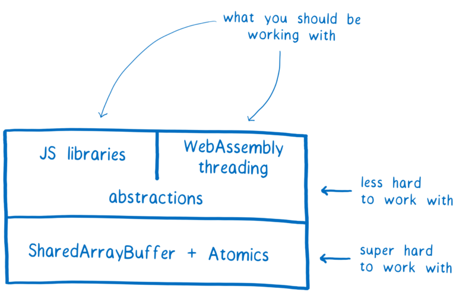

即使你不大可能直接使用 SharedArrayBuffers 和 Atomics，但我相信你一定会对他们的工作原理感兴趣。所以，在本文中我会介绍由并发引起的几种竞态条件，以及 Atomics 是怎么避免它们的。

那么，竞态条件是什么？

### 竞态条件：一个你以前可能见过的例子

当有一个变量在两个线程之间共享时，可能会发生一个非常简单的竞态条件示例。假设一个线程想加载一个文件，另一个线程检查它是否存在。他们共享一个变量 `fileExists` 来通讯。

`fileExists` 的初始值是 false 。

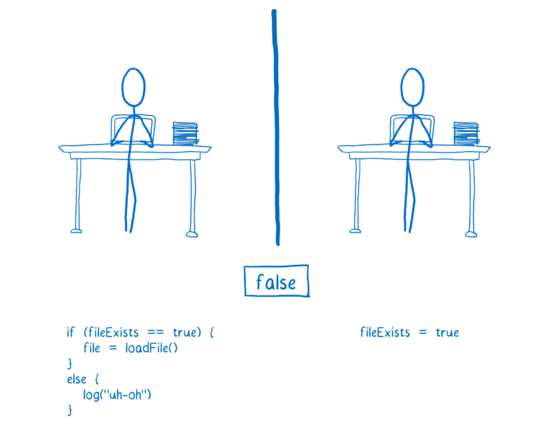

只要线程 2 中的代码首先运行，文件将被加载。

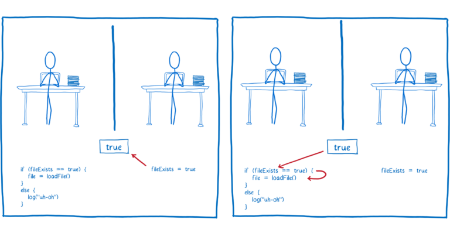

但如果线程 1 中的代码首先运行，那么它将向用户记录一个错误，指出该文件不存在。

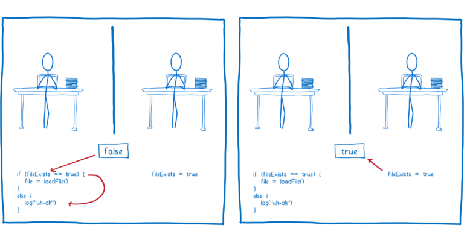

但这并不是问题所在，并不是文件真的不存在。真正的问题是竞态条件。

上面提到的竞态条件，在 JavaScript 这种单线程的语言中也时有发生。即使你毫无多线程的概念，也能理解上面竞态条件的发生。

然而，有些竞态条件在单线程代码中是不可能的，只有当你使用多线程进行编程并且这些线程共享内存时，才会发生这种情况。

## 不同类型的竞态条件和各类型下 Atomics 的作用

让我们来探讨一些在多线程代码中可以遇到的不同类型的竞态条件，以及 Atomics 是如何帮助避免它们的。这不包括所有可能的竞态条件，但应该让你理解为什么 Atomics 的 API 要提供这些方法。

在开始之前，我要再强调一次：你不需要直接使用 Atomics。编写多线程代码是一个已知的难题。
使用可靠的库来处理多线程代码中的共享内存才是你最好的选择。

### 单步操作下的竞态条件

假设两个线程对同一个变量做加法运算。你可能会认为不论哪个线程先执行结果是一样的。

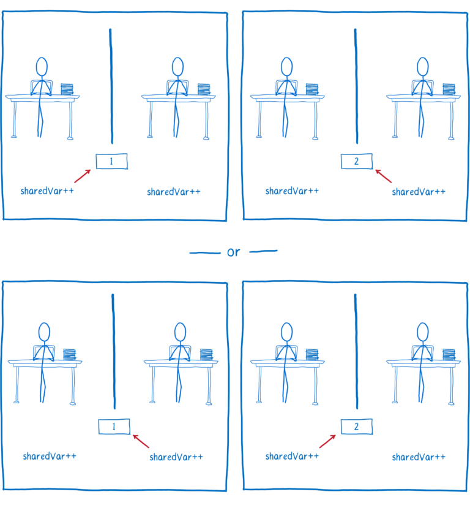

虽然在源代码中，变量自增看起来像一步操作，但当你查看编译的代码时，它并不是一个单一的操作。

在CPU级别，加法运算需要三条指令。这是因为计算机具有长期存储器和短期存储器。

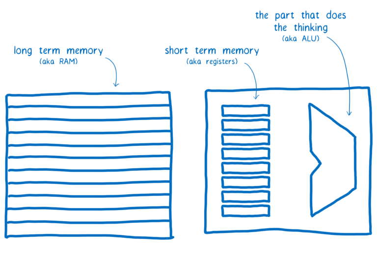

所有线程共享长期存储器。但是短期存储器（寄存器）不共享。

每个线程需要先从内存中把值放入短期存储器。然后对其进行计算。最后，把计算后的值返回给长期存储器。

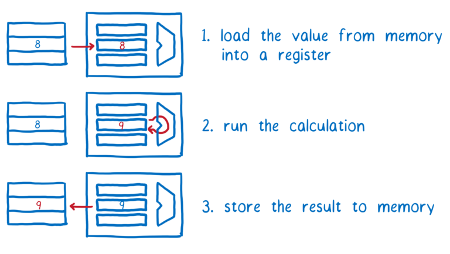

如果线程 1 中的所有操作先执行，然后线程 2 中的操作再执行，所得结果将符合预期。

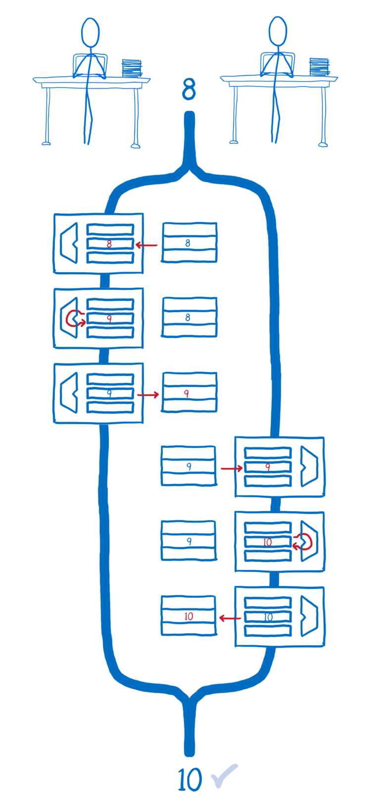

但是，如果它们是交叉执行的，则线程 2 已纳入其寄存器中的值与内存中的值不同步。这意味着线程 2 不考虑线程 1 的计算，而只是用它的计算结果覆盖掉线程 1 的。

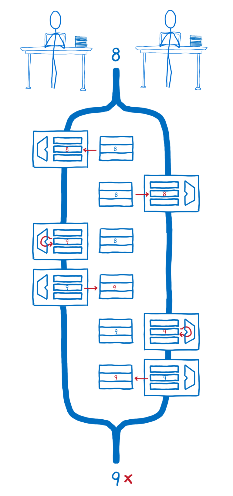

有些操作，人类认为是单步骤的，而计算机视作是多个。原子操作所做的就是让计算机同人类一样也把这些操作视为一步。

之所以称它们为原子操作，是因为它们采取的操作通常会有多个指令（指令可以暂停和恢复）它使得它们全部发生在瞬间，就像是一个指令一样。看起来就像一个不可分割的原子。

使用原子操作，变量自增代码写起来会有所不同。

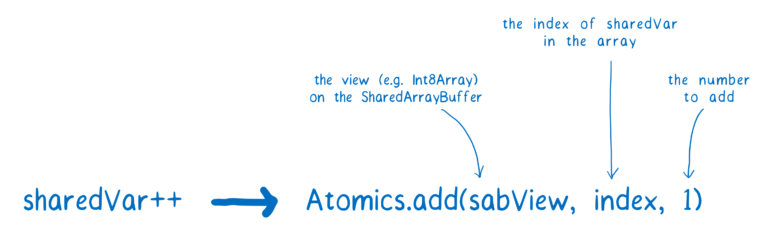

现在我们使用 Atomics.add，加法执行过程中不会因为多线程而被打乱。一个线程在执行完原子操作前会阻止其它线程启动，之后其它线程才会执行自己的原子操作。

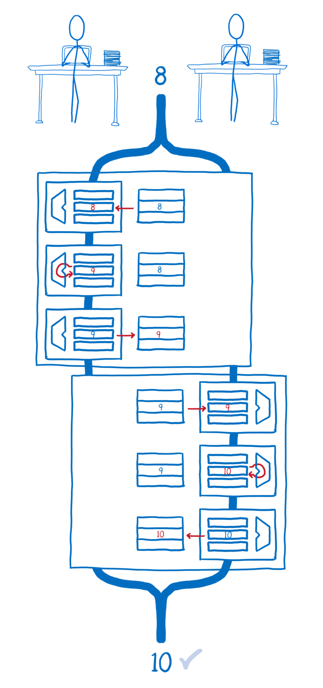

下面这些 Atomics 方法专门用来避免这种竞态条件：

* [Atomics.add](https://developer.mozilla.org/en-US/docs/Web/JavaScript/Reference/Global_Objects/Atomics/add)
* [Atomics.sub](https://developer.mozilla.org/en-US/docs/Web/JavaScript/Reference/Global_Objects/Atomics/sub)
* [Atomics.and](https://developer.mozilla.org/en-US/docs/Web/JavaScript/Reference/Global_Objects/Atomics/and)
* [Atomics.or](https://developer.mozilla.org/en-US/docs/Web/JavaScript/Reference/Global_Objects/Atomics/or)
* [Atomics.xor](https://developer.mozilla.org/en-US/docs/Web/JavaScript/Reference/Global_Objects/Atomics/xor)
* [Atomics.exchange](https://developer.mozilla.org/en-US/docs/Web/JavaScript/Reference/Global_Objects/Atomics/exchange)

你可能注意到了，这个列表是相当有限的。它甚至不包括除法和乘法等。不过，库开发人员会提供类似这些常见的原子操作。

库开发人员会借助 [Atomics.compareExchange](https://developer.mozilla.org/en-US/docs/Web/JavaScript/Reference/Global_Objects/Atomics/compareExchange) 从 SharedArrayBuffer 拿到值，对其执行操作，然后只有在自上次检查到现在没有其它线程更新的情况下才会去写回。如果期间有其它线程更新了，则会先拿到新的值重新运算一次。

### 多操作下的竞态条件

前面提到，原子操作可以帮助我们避免单步操作下的竞态条件。但有时你想要更改对象上的多个值（使用多个操作），并确保没有其他人同时对该对象进行更改。基本上，这意味着在对象的每次更改期间，该对象处于锁定状态，而其他线程无法访问。

Atomics 没有直接提供处理这种情况的工具。但是它提供了一些方法，库开发人员可以利用这些方法制作一把锁来处理这种情况。

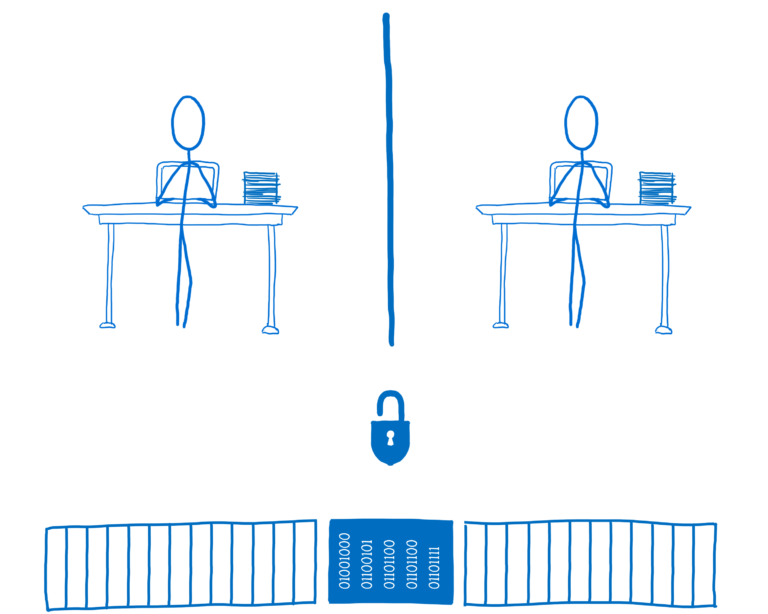

如果代码想使用某个被锁住的数据，首先它需要去请求锁，之后它会用这把锁把其它线程锁在外面，只有它自己可以访问和更新这块数据。

要构建一个锁，库开发者将使用 [Atomics.wait](https://developer.mozilla.org/en-US/docs/Web/JavaScript/Reference/Global_Objects/Atomics/wait) 和 [Atomics.wake](https://developer.mozilla.org/en-US/docs/Web/JavaScript/Reference/Global_Objects/Atomics/wake)，以及其他的，如 [Atomics.compareExchange](https://developer.mozilla.org/en-US/docs/Web/JavaScript/Reference/Global_Objects/Atomics/compareExchange) 和 [Atomics.store](https://developer.mozilla.org/en-US/docs/Web/JavaScript/Reference/Global_Objects/Atomics/store)。如果你想了解它们是如何工作的，可以看看这个[基础锁的实现](https://github.com/lars-t-hansen/js-lock-and-condition)。

在这种情况下，线程 2 获取数据锁，并将 `locked` 的值设置为 true。这意味着线程 1 无法访问数据，直到线程 2 解锁。

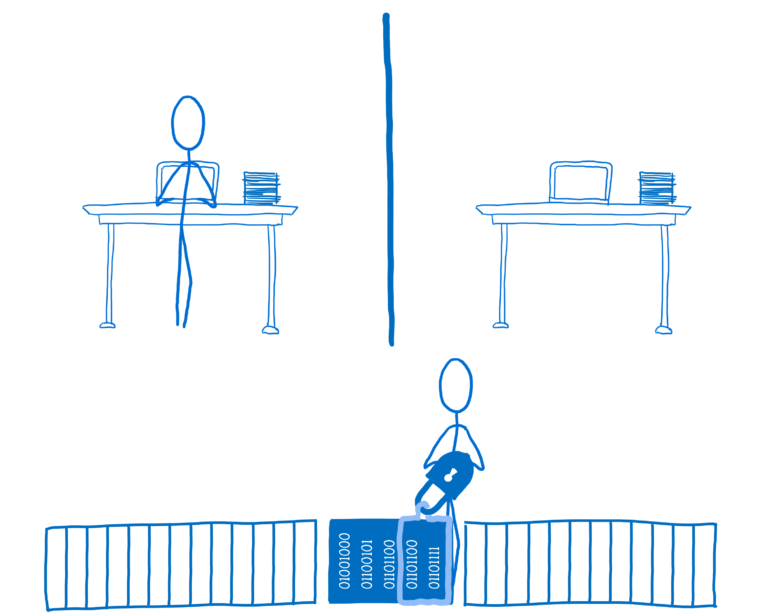

如果线程 1 需要访问数据，它要尝试获取锁。但是由于锁已经在使用，所以显然会失败。线程 1 会一直等着直到锁可用。

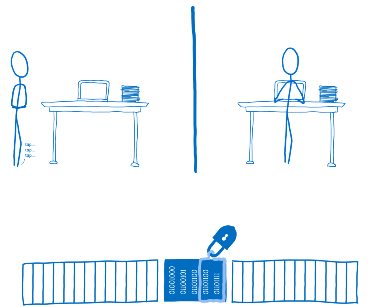

一旦线程 2 完成，它将调用解锁。锁将通知一个或多个在等待的线程现在可用。

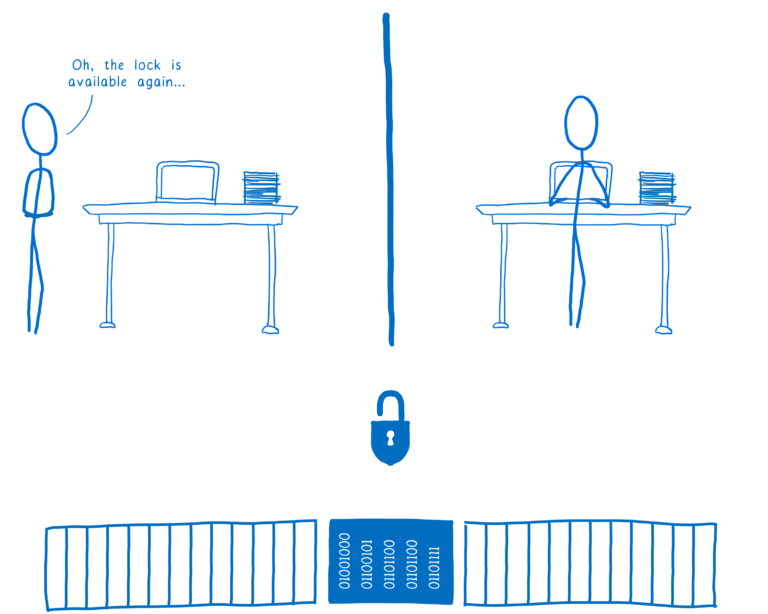

下一个线程拿起锁，把数据锁上供自己使用。

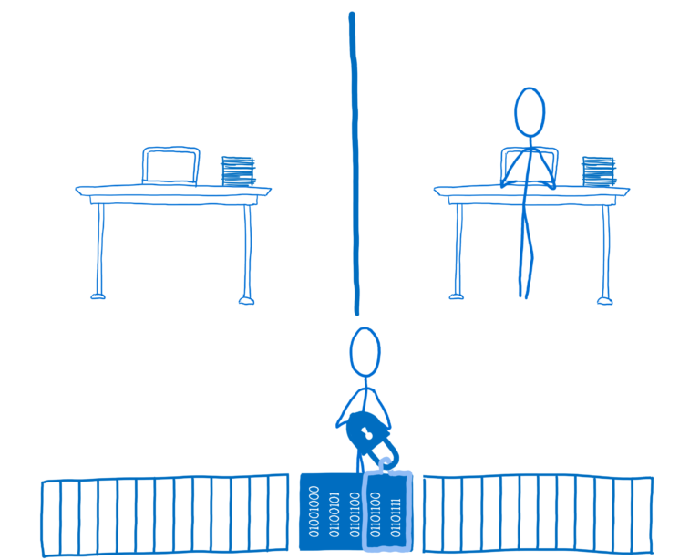

一个锁库将使用 Atomics 对象上的许多不同方法，但对于这种用例最重要的方法是：

* [Atomics.wait](https://developer.mozilla.org/en-US/docs/Web/JavaScript/Reference/Global_Objects/Atomics/wait)
* [Atomics.wake](https://developer.mozilla.org/en-US/docs/Web/JavaScript/Reference/Global_Objects/Atomics/wake)

### 指令重新排序引起的竞态条件

Atomics 需要处理第三个同步问题，这类问题可能比较神奇。

你可能觉察不到，就是你写的代码并没有按照你期望的顺序执行。因为编译器和 CPU 会重新排序代码，使其运行速度更快。

举个例子，假设你已经写了一段代码来计算总计。你想在计算结束时设置一个标志。

编译的时候需要决定每个变量该用哪个寄存器，之后就可以把代码翻译成机器的指令了。

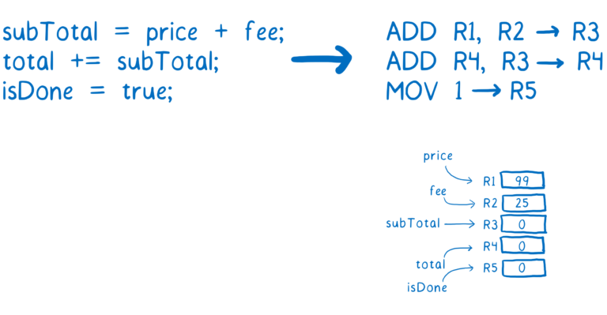

到目前为止，没什么问题。

如果你对计算机在芯片级别的工作不那么了解的话（以及它们用于执行代码工作的管道），可能你没发现到第 2 行需要等待下才能执行。

大多数计算机将运行指令的过程分解为多个步骤。这样可以确保 CPU 的所有不同部分始终处于忙碌状态，以充分利用 CPU。

下面的例子展示了指令执行的每一步：

1. 从内存中读取下一条指令
2. 找出指令告诉我们做什么（也就是解码指令），并从寄存器获取值
3. 执行指令
4. 将结果写回寄存器

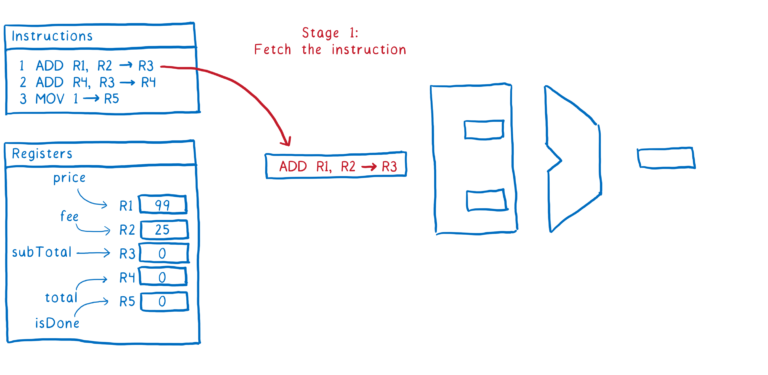

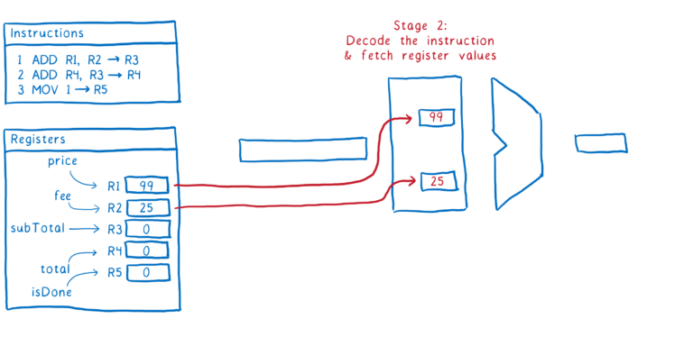

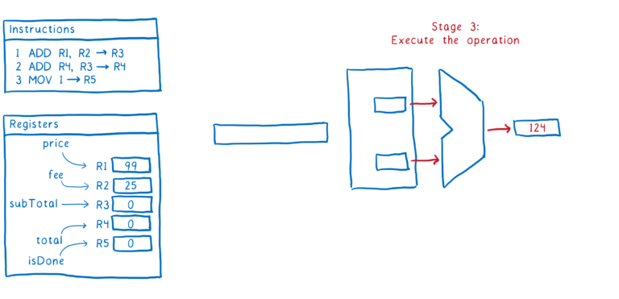

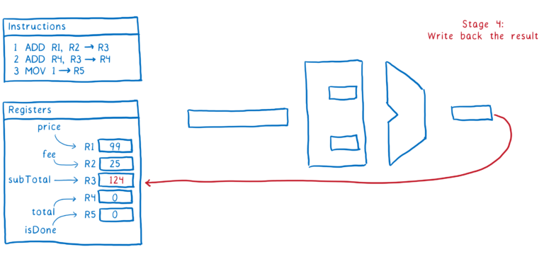

这就是指令的每一步操作流程，理想的情况是第二个指令会紧紧地跟着第一个指令，当第一个指令进行到步骤 2 的时候，第二个指令进行步骤 1。

问题是指令＃1和指令＃2之间存在依赖关系。

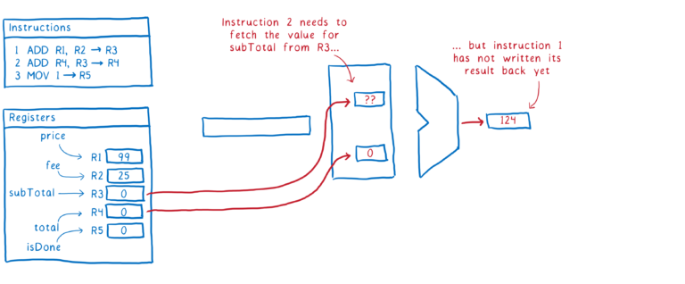

我们可以暂停 CPU，直到指令＃1更新了寄存器中的 `subTotal`。但这样效率很低。

为了提高效率，很多编译器和 CPU 会重新排序代码。他们将寻找不使用 `subTotal` 或 `total` 的其他指令，并将它们移动到两个指令之间。

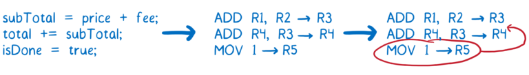

这保持了稳定的指令流通过管道。

因为第 3 行不依赖于第 1 行或第 2 行中的任何值，所以编译器或 CPU 认为可以像这样重新排序。在单线程运行时，这样是没问题的，因为无论如何，在整个函数完成之前，其他代码都不会看到这些值。

但是当另一个线程在另一个处理器上同时运行时，情况又有所不同。另一个线程不需要等到整个函数完成后才能看到值得更改。几乎在值回到内存的第一时间，它就可以看到他们。这样一来 `isDone` 的值在 `total` 之前改变了。

如果你使用 `isDone` 作为 `total` 已经计算好并可以另一个线程中使用的标志，那么这种重新排序将造成竞态条件的发生。

Atomics 尝试解决这些问题。使用 Atomic 时，就像将代码分开放在两个部分。

原子操作相互不重新排序，其他操作也不会在其周围移动。其中，有两个经常用到的操作：

* [Atomics.load](https://developer.mozilla.org/en-US/docs/Web/JavaScript/Reference/Global_Objects/Atomics/load)
* [Atomics.store](https://developer.mozilla.org/en-US/docs/Web/JavaScript/Reference/Global_Objects/Atomics/store)

`Atomics.store` 能确保：在源代码中它之前的变量都更新完成后再将变量的值返回内存中。即使非原子指令会被重新排序，也不会被移动到 `Atomics.store` 下面。

`Atomics.load` 能确保在它之后的变量，要在它获取了变量的值之后再赋值给变量。同样的，即使非原子指令被重新排序，也不会被移动到 `Atomics.load` 的前面。

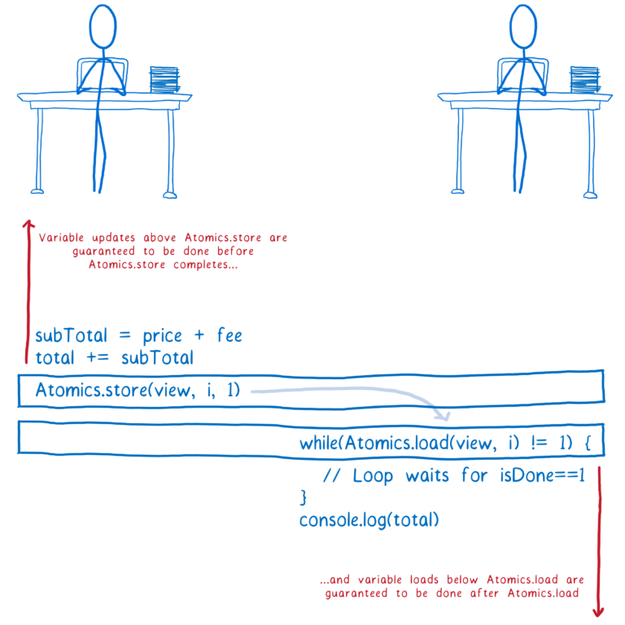

注意：这里显示的 while 循环称为自旋锁，效率非常低。如果它在主线程上，它可以使您的应用程序停止。你肯定不会想在真实的代码中使用它。

再次强调，这些方法并不意味着直接用在应用程序代码中。相反，库将使用它们来创建锁。

### 总结

编程共享内存的多个线程很难。有很多不同种类的竞态条件正在等待你的到来。

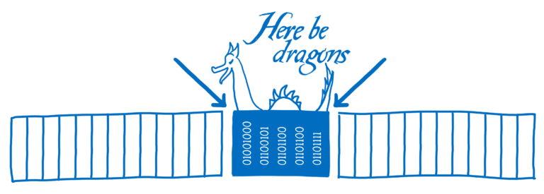

这就是为什么你不想直接在应用程序代码中使用 SharedArrayBuffers 和 Atomics。那些经过具有多线程开发经验的，以及专门花时间研究内存模型的开发人员验证过的库，会是你最好的选择。

这些对于 SharedArrayBuffer 和 Atomics 来说还为时尚早。那些库尚未开发。但是这些新的 API 提供了基础的基础。